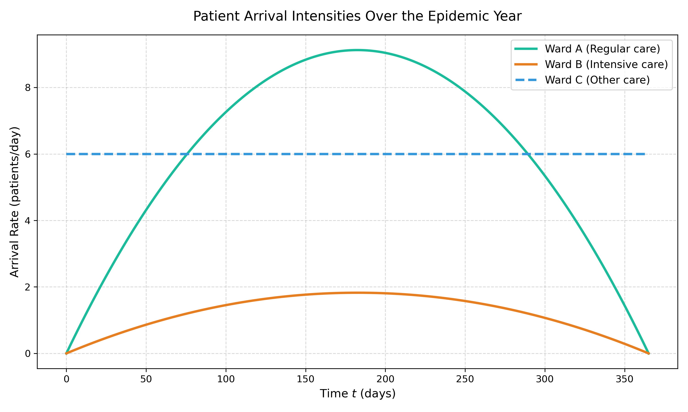
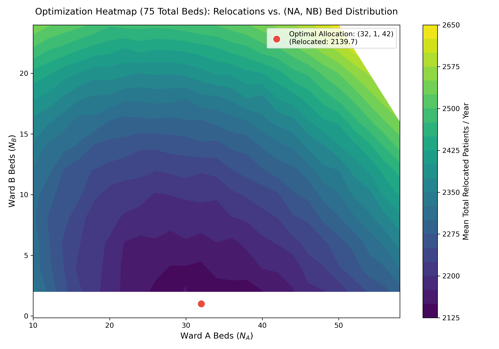
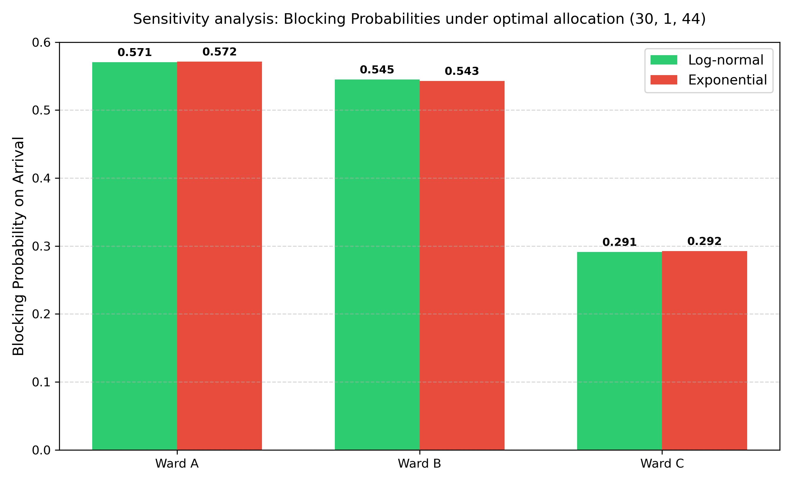
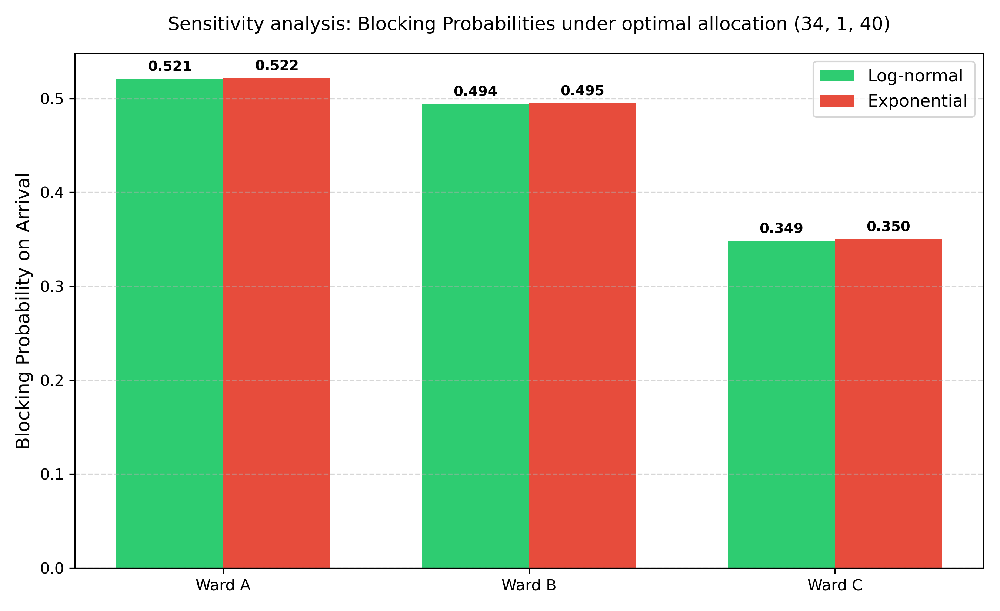
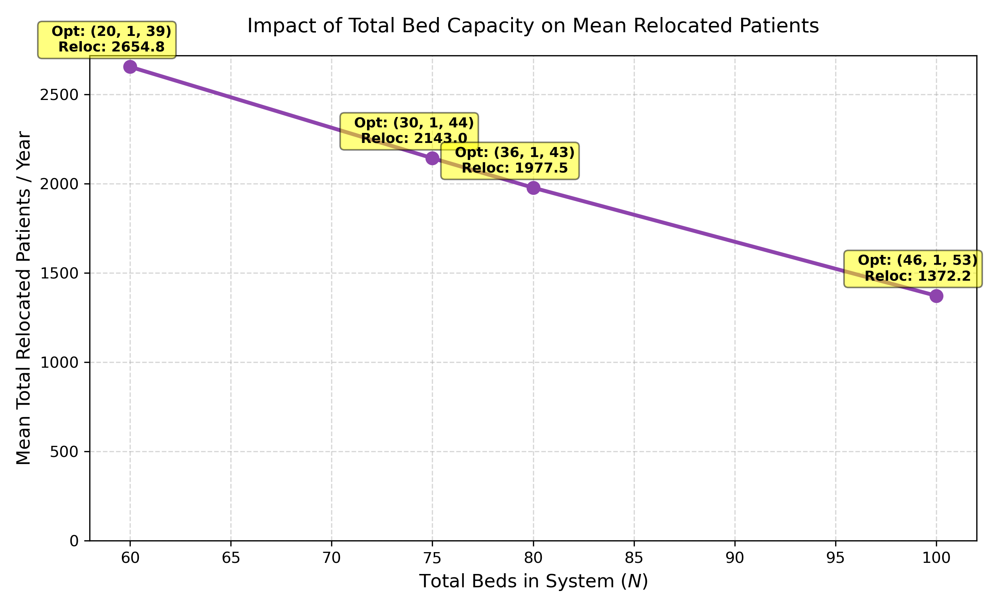
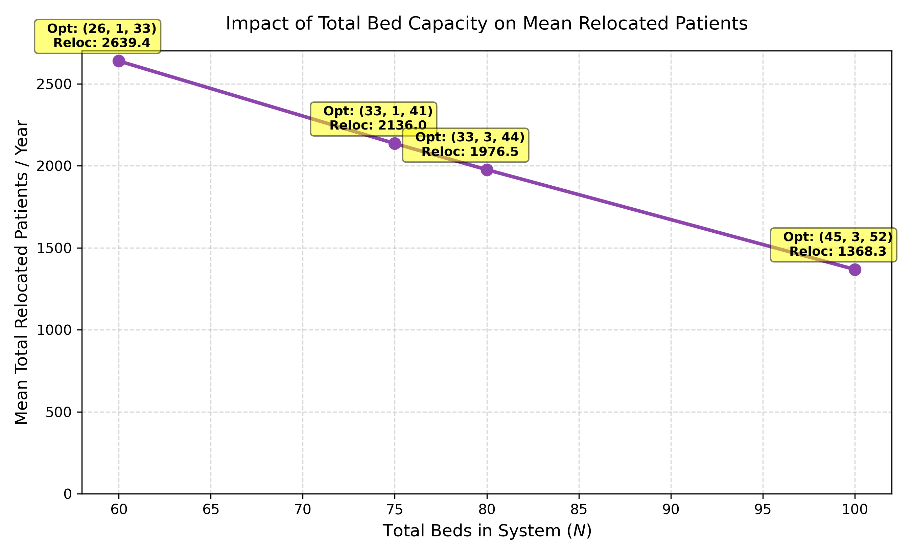

# Hospital Bed Simulation & Optimization Report

This report presents the findings from the stochastic simulation models developed to evaluate the utilization of hospital beds in three wards (Ward A, Ward B, and Ward C) over a 365-day epidemic period. 

We implemented and compared two exact algorithms for generating Non-Homogeneous Poisson Process (NHPP) arrivals:
1. **Option A: Time-Transformation (Inversion) Method** (via numerical Bisection)
2. **Option B: Acceptance-Rejection (Thinning) Method**

Both models were run for **100 replications** per configuration to estimate the performance measures.

---

## 1. NHPP Arrival Generation Comparison

Both methods yield identical statistics in the limit, but approach the problem differently:
* **Option A (Inversion):** Generates arrivals on a homogeneous timeline ($S \sim \text{Poisson}(1)$) and uses bisection search to map them to the real timeline using the inverse cumulative intensity function $t = \Lambda^{-1}(S)$. This is mathematically exact and builds directly on the **Inverse Transform Method**.
* **Option B (Rejection):** Proposes arrival times using a homogeneous process running at the peak intensity $\lambda_{\max}$, then accepts each proposal with probability $p(t) = \lambda(t)/\lambda_{\max}$. This builds directly on the **Acceptance-Rejection Method**.

### Arrival Intensity Curves
Both scripts produced identical arrival profiles over the year:
````carousel

<!-- slide -->

````

---

## 2. Bed Allocation Optimization ($N = 75$)

We optimized the bed distribution $(N_A, N_B, N_C)$ to minimize the **total number of relocated patients** (the sum of relocated patients across all three types). 

### Baseline vs. Optimal Results

| Metric | Baseline: Inversion ($25, 15, 35$) | Optimal: Inversion ($30, 1, 44$) | Baseline: Rejection ($25, 15, 35$) | Optimal: Rejection ($34, 1, 40$) |
| :--- | :---: | :---: | :---: | :---: |
| **Ward A (Regular) Beds** | 25 | 30 | 25 | 34 |
| **Ward B (Intensive) Beds** | 15 | 1 | 15 | 1 |
| **Ward C (Other) Beds** | 35 | 44 | 35 | 40 |
| **Mean Relocated (Regular)** | 1270.81 | 1263.31 | 1265.09 | 1158.66 |
| **Mean Relocated (Intensive)** | 75.61 | 241.19 | 77.22 | 221.03 |
| **Mean Relocated (Other)** | 931.52 | 635.43 | 941.62 | 762.69 |
| **Total Mean Relocated** | **2277.94** | **2139.94** | **2283.93** | **2142.39** |
| **Ward A Utilization** | 87.42% | 88.08% | 87.43% | 86.91% |
| **Ward B Utilization** | 71.16% | 89.17% | 71.69% | 89.90% |
| **Ward C Utilization** | 95.64% | 94.17% | 95.75% | 94.91% |

### Key Discussion Point: Why is $N_B = 1$ Optimal?
At first glance, allocating only **1 bed** to Ward B (Intensive Care) seems counter-intuitive and dangerous. However, it is mathematically optimal under the routing rules:
1. **Flexible Spillover:** If an intensive care patient arrives and Ward B is full, they can spill over into Ward A. However, if a regular patient arrives and Ward A is full, they are immediately relocated (lost). Ward C patients also have no spillover.
2. **Resource Pooling:** By shifting beds from B to A, we make those beds "flexible" (available to both regular and intensive patients). Keeping beds in Ward B is restrictive because regular patients cannot use them. 
3. **Optimizing the Sum:** Minimizing the sum of relocated patients pushes resources to where they are most flexible (Ward A) and where demand is highest relative to capacity (Ward C).

### Optimization Heatmaps
The following heatmaps show the total relocated patients as a function of the Ward A and Ward B bed allocation. The red dot marks the optimal configuration:
````carousel

<!-- slide -->

````

---

## 3. Length-of-Stay (LOS) Sensitivity Analysis

We evaluated the system's sensitivity to the LOS distribution by replacing the **Log-normal** distribution with an **Exponential** distribution with the same means ($Mean_A = 8, Mean_B = 12, Mean_C = 10$).

As shown in the bar charts, the blocking probabilities are highly sensitive to the distribution type:
* **Log-normal** distributions, which have higher variance and a heavier right tail, generally lead to higher congestion and slightly higher blocking probabilities in bottleneck wards compared to **Exponential** service times.
* This highlights that assuming exponential LOS for mathematical convenience (as is common in classical queueing theory) would lead to underestimating patient relocation rates in hospital planning.

````carousel

<!-- slide -->

````

---

## 4. Bed Capacity Impact Analysis

Lastly, we evaluated the impact of varying the total bed capacity ($N = 60, 75, 80, 100$). The plots show the minimum relocated patients as a function of total capacity:

* Reducing capacity to **60 beds** drastically increases relocated patients.
* Increasing capacity to **100 beds** reduces relocations significantly, though a non-zero number remains due to peak epidemic spikes.
* The optimal bed distribution adjusts dynamically (e.g., as total beds increase, more beds are allocated to Ward C to handle its high load).

````carousel

<!-- slide -->

````
